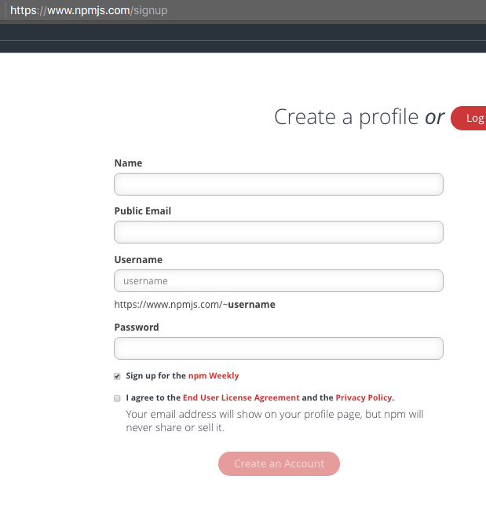

Para comenzar, crearemos una cuenta de usuario en el repositorio de NPM mediante la cual publicar nuestros propios paquetes:

Abrir el navegador.

* Ir a [https://npmjs.org](https://npmjs.org)

* Hacer clic en el enlace [sign up](https://www.npmjs.com/login)

* Rellenar el formulario de alta:



* Aceptar los términos de licencia.

* Hacer clic en el botón Create an Account para crear la cuenta.


::: danger ¡No olvide verificar su email!

Vaya a su cuenta de correo: debería tener un email de npm.

Este es un paso en el que muchos nos despistamos.

:::

Una vez creada la cuenta, hay que abrir sesión con el servidor NPM para poder publicar paquetes en él. Abrir una consola.

Conectar al repositorio: 

`$ npm login`

Rellene los datos que le solicita.

Consultar la cuenta con la que tenemos abierta la sesión:

```
$ npm whoami
```

**Otra forma de darse de alta desde línea de comandos:**

* Ejecuta en la terminal estos comandos:

	```bash
			npm set init.author.name "Casiano Rodriguez-Leon"
			npm set init.author.email "whatever@gmail.com"
			npm set init.author.url "https://github.com/crguezl"
	```
* El siguiente comando nos perdirá un email y una  password, creando o verificando 
un usuario en el [npm registry](https://docs.npmjs.com/misc/registry), y 
guardará el token en el fichero 
`~/.npmrc`:

	```bash
			npm adduser
	```
